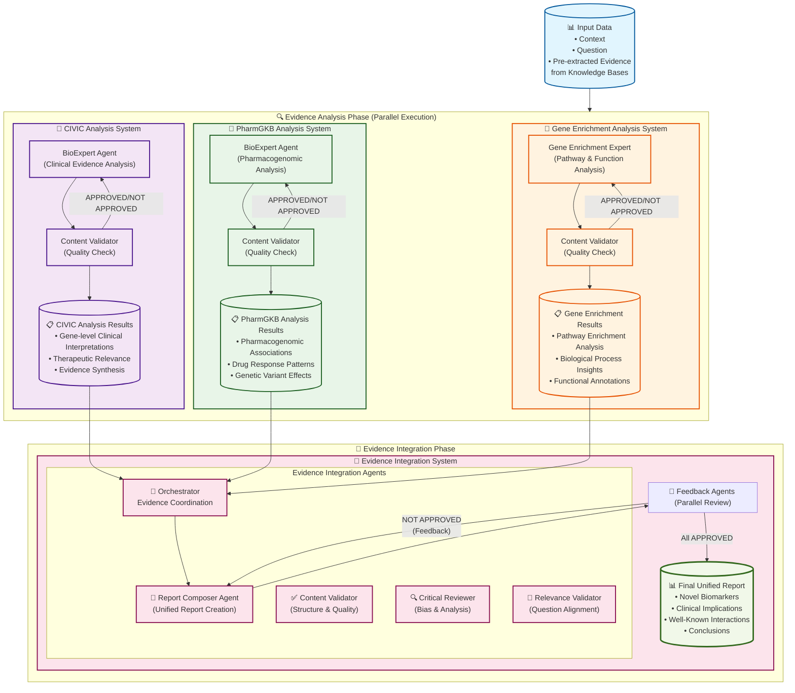

# Agent Systems Orchestration Diagram

This diagram shows how the four agent systems work together in the CEE DART Navigator.

## System Overview

### 🔍 **Phase 1: Parallel Evidence Analysis**
Three independent agent systems analyze pre-extracted evidence simultaneously:

1. **CIVIC System** 🧬
   - Analyzes pre-extracted clinical evidence for genetic variants
   - Produces gene-level clinical interpretations and therapeutic relevance assessments
   - Uses BioExpert + Content Validator agents

2. **PharmGKB System** 💊
   - Processes pre-extracted pharmacogenomic evidence
   - Generates pharmacogenomic associations and drug response pattern analysis
   - Uses BioExpert + Content Validator agents

3. **GProfiler System** 🔬
   - Analyzes gene sets for pathway and functional enrichment
   - Produces pathway enrichment analysis and biological process insights
   - Uses Gene Enrichment Expert + Content Validator agents

### 🔄 **Phase 2: Evidence Integration**
The **Evidence Integration System** 🎯 integrates all evidence:

1. **Orchestrator Agent** 🎭
   - Consolidates evidence from all three systems
   - Coordinates the integration workflow

2. **Report Composer Agent** 📝
   - Creates unified reports with 4 sections:
     - Potential Novel Biomarkers
     - Clinical Implications  
     - Well-Known Interactions
     - Conclusions

3. **Feedback Agents** 👥 (Parallel Review)
   - **Content Validator**: Checks structure and quality
   - **Critical Reviewer**: Identifies biases and alternative interpretations
   - **Relevance Validator**: Ensures question alignment and novelty assessment

### 🔄 **Iterative Refinement**
- If any feedback agent responds "NOT APPROVED", the Report Composer revises the report
- Process continues until all three feedback agents approve
- Maximum iterations prevent infinite loops

### 📊 **Final Output**
Comprehensive unified report addressing the user's research question with evidence from all three biomedical knowledge sources. 