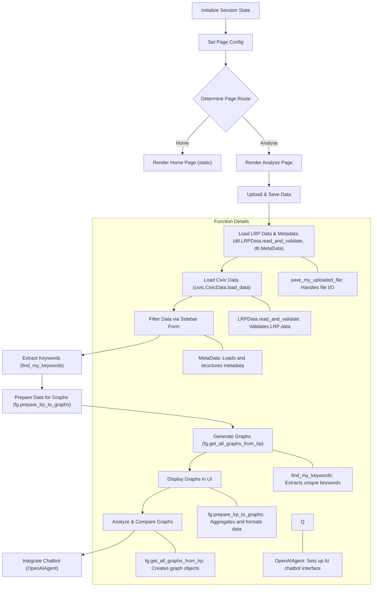

```mermaid
graph TD
    %% Initialization & Routing
    A[Initialize Session State] --> B[Set Page Config]
    B --> C{Determine Page Route}
    C -->|Home| D["Render Home Page (static)"]
    C -->|Analyse| E["Render Analyse Page"]
    
    %% Data Upload & File Saving
    E --> F["Upload & Save Data"]
    F --> G["Load LRP Data & Metadata (dtl.LRPData.read_and_validate, dtl.MetaData)"]
    G --> H["Load Civic Data (civic.CivicData.load_data)"]
    
    %% Data Processing & Filtering
    H --> I["Filter Data via Sidebar Form"]
    I --> J["Extract Keywords (find_my_keywords)"]
    J --> K["Prepare Data for Graphs (fg.prepare_lrp_to_graphs)"]
    
    %% Graph Generation & Analysis
    K --> L["Generate Graphs (fg.get_all_graphs_from_lrp)"]
    L --> M["Display Graphs in UI"]
    M --> N["Analyze & Compare Graphs"]
    N --> O["Integrate Chatbot (OpenAIAgent)"]
    
    %% Detailed Function Calls (For clarity)
    subgraph "Function Details"
        G --- G1[save_my_uploaded_file: Handles file I/O]
        H --- H1[LRPData.read_and_validate: Validates LRP data]
        I --- I1[MetaData: Loads and structures metadata]
        L --- L1[find_my_keywords: Extracts unique keywords]
        M --- M1[fg.prepare_lrp_to_graphs: Aggregates and formats data]
        N --- N1[fg.get_all_graphs_from_lrp: Creates graph objects]
        Q --- Q1[OpenAIAgent: Sets up AI chatbot interface]
    end
```
````