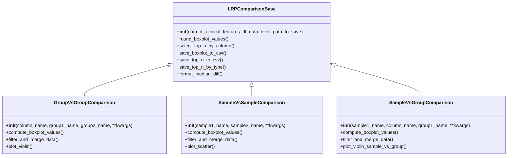

# Class Structure Overview

```mermaid
classDiagram
LRPComparisonBase <|-- GroupVsGroupComparison
LRPComparisonBase <|-- SampleVsSampleComparison
LRPComparisonBase <|-- SampleVsGroupComparison

class LRPComparisonBase {
    +__init__(data_df, clinical_features_df, data_level, path_to_save)
    +round_boxplot_values()
    +select_top_n_by_column()
    +save_boxplot_to_csv()
    +save_top_n_to_csv()
    +save_top_n_by_type()
    +format_median_diff()
}

%% Universal functions for all subclasses are defined here, such as rounding and exporting.

class GroupVsGroupComparison {
    +__init__(column_name, group1_name, group2_name, **kwargs)
    +compute_boxplot_values()
    +filter_and_merge_data()
    +plot_violin()
}

class SampleVsSampleComparison {
    +__init__(sample1_name, sample2_name, **kwargs)
    +compute_boxplot_values()
    +filter_and_merge_data()
    +plot_scatter()
}

class SampleVsGroupComparison {
    +__init__(sample1_name, column_name, group1_name, **kwargs)
    +compute_boxplot_values()
    +filter_and_merge_data()
    +plot_violin_sample_vs_group()
}
```