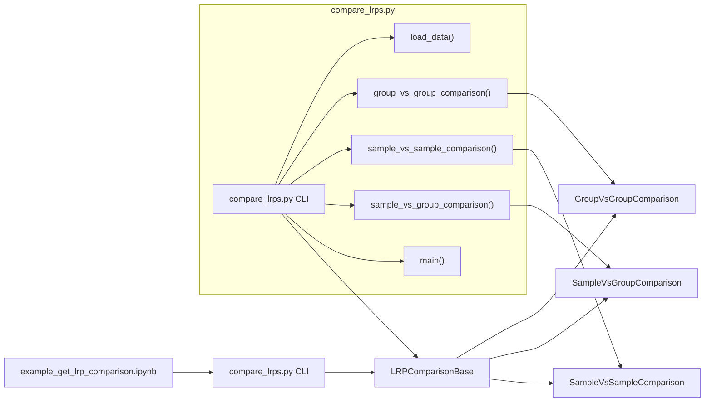

# LRP Analysis Relationship Diagram

```mermaid
graph LR
    notebook[example_get_lrp_comparison.ipynb]
    compare_lrps[compare_lrps.py CLI]
    base_class[LRPComparisonBase]
    gvg_class[GroupVsGroupComparison]
    svg_class[SampleVsGroupComparison]
    svs_class[SampleVsSampleComparison]

    notebook --> compare_lrps
    compare_lrps --> base_class
    base_class --> gvg_class
    base_class --> svg_class
    base_class --> svs_class

    subgraph compare_lrps.py
        compare_lrps_main["compare_lrps.py CLI"]
        load_data["load_data()"]
        group_vs_group["group_vs_group_comparison()"]
        sample_vs_sample["sample_vs_sample_comparison()"]
        sample_vs_group["sample_vs_group_comparison()"]
        main_fn["main()"]
        compare_lrps_main --> load_data
        compare_lrps_main --> group_vs_group
        compare_lrps_main --> sample_vs_sample
        compare_lrps_main --> sample_vs_group
        compare_lrps_main --> main_fn
    end

    compare_lrps_main --> base_class
    group_vs_group --> gvg_class
    sample_vs_sample --> svs_class
    sample_vs_group --> svg_class
```